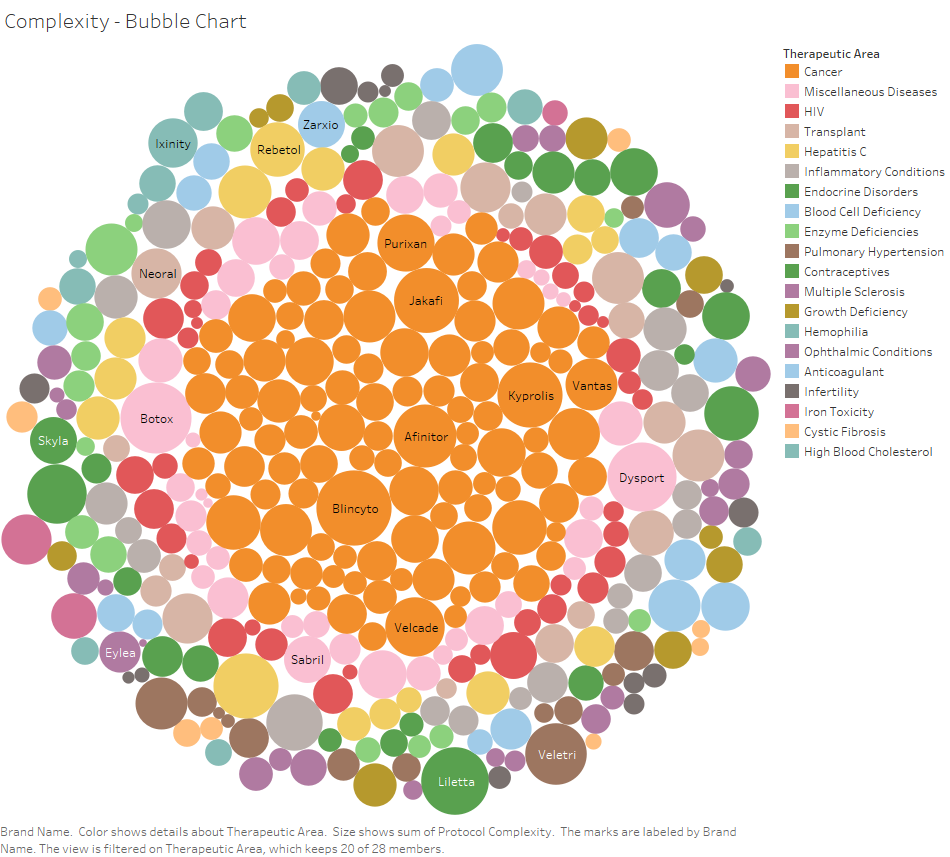

## Load data
```{r message=FALSE, warning=FALSE}
library(readxl)
library(ggplot2)
library(RColorBrewer)
library(formattable)

Ranking_report <- read_excel("Ranking fields.xlsx", 
                             col_types = c("text", "text", "numeric", 
                                           "numeric", "numeric", "numeric", 
                                           "numeric", "numeric", "numeric", 
                                           "numeric", "date"))
attach(Ranking_report)
```

## Handle Missing Values
```{r}
# Set NA's to one
cols = c(3:5)
Ranking_report[cols] = data.frame(lapply(Ranking_report[cols], function(x) {
  ifelse(is.na(x), 1, x)
  }))

# Set zeros to one, dosage forms with "KIT" didn't have a route
Ranking_report$num_routes[num_routes == 0] <- 1

# Protocol Complexity
Ranking_report$protocol_complexity[protocol_complexity == 0] <- NA
avg_wc = mean(protocol_complexity, na.rm = TRUE)
Ranking_report$protocol_complexity[is.na(Ranking_report$protocol_complexity)] <- avg_wc

# Set NA's to column median
# Check out the medians
median_spending = median(Total_Spending_2015, na.rm = TRUE)
median_acpu = median(ACPU, na.rm = TRUE)
median_count = mean(Beneficiary_2015, na.rm = TRUE)
median_date = mean(Start_Marketing_Date, na.rm = TRUE)

# Replace NA's
cols = c(7,9,10)
Ranking_report[cols] = data.frame(lapply(Ranking_report[cols], function(x) {
  ifelse(is.na(x), median(x, na.rm=TRUE), x)
  }))
Ranking_report$Total_Spending_2015[is.na(Ranking_report$Total_Spending_2015)] <- median_date

# Set NA's to 0
Ranking_report$Spending_Change[is.na(Spending_Change)] = 0
```

## Protocol Complexity by Therapeutic Area
```{r}

```
Looking at a bubble chart of the protocol complexity, we can see the top individual drugs with the highest complexity while also viewing the therapeutic area. From this chart it seems that cancer drugs as group might have higher complexity.

```{r}
# Box Plot
ggplot(Ranking_report, aes(x = therapeutic_area, y = protocol_complexity)) + 
  geom_boxplot() +
  theme(axis.text.x=element_text(angle=90))
```
A box plot gives a clearly picture of complexity by therapeutic area. Cancer, Hepatitis C and Miscellaneous Diseases have individual drugs with very high complexity but as a group Contraceptives have the highest complexity.

```{r}
# One-way ANOVA - Therapeutic Area
res.aov <- aov(protocol_complexity ~ therapeutic_area, data = Ranking_report)
summary(res.aov)
```
The p-value is nearly 0. The ANOVA test shows that when grouped by therapeutic area, there is a significant difference in complexity.

## Clustering
```{r}
numeric_columns <- c(3:10)
dfNorm <- scale(Ranking_report[,numeric_columns], center=TRUE, scale=TRUE)

d <- dist(dfNorm, method = "euclidean") # distance matrix
fit <- hclust(d, method="ward.D") 
```
Clustering was performed using number of labelers, number of dosage forms, number of routes, protocol complexity, total spending, change in spending, average cost per unit, and beneficiary count.
```{r}
groups5 <- cutree(fit, k=5) # cut tree
table(groups5)
```

```{r}
plot(fit) # display dendogram
rect.hclust(fit, k=5, border="red")
```

```{r}
groups6 <- cutree(fit, k=6) # cut tree
table(groups6)
```

```{r}
plot(fit) # display dendogram
rect.hclust(fit, k=6, border="blue")
```
```{r}
groups7 <- cutree(fit, k=7) # cut tree
table(groups7)
```

```{r}
plot(fit) # display dendogram
rect.hclust(fit, k=7, border="green")
```

```{r}
groups <- groups6
table(groups)
```
Six seems to be the correct number of clusters. It breaks the largest group in five clusters into two. Going to seven produces an additional cluster with only 7 members.

## Therapeutic Areas of Groups
```{r}
# Groups by Therapeutic Area
groups_by_therapeutic <- table(Ranking_report$therapeutic_area, groups)
groups_by_therapeutic
```
Tabulate the clusters by therapeutic area to see if they happen to fall into clusters by the areas. They don't appear to.

```{r fig.width=8}
# Stacked barplot
groups_by_therapeutic_df <- as.data.frame(groups_by_therapeutic)
colnames(groups_by_therapeutic_df) = c("therapeutic_area", "group", "freq")

colourCount <- nlevels(groups_by_therapeutic_df$therapeutic_area)
getPalette <- colorRampPalette(brewer.pal(9, "Set1"))

stacked_barplot <- ggplot() + 
  geom_bar(aes(y = freq, x = group, fill = therapeutic_area), 
           data = groups_by_therapeutic_df, stat = "identity") +
  ggtitle("Therapeutic Areas of Groups") +
  theme(legend.position = "bottom", legend.direction = "horizontal",
        legend.title = element_blank()) +
  scale_fill_manual(values = getPalette(colourCount))
stacked_barplot
```
A stacked bar chart is a good way to visualize the therapeutic areas of the clusters. It confirms that the clusters are not by therapeutic area.

## Characteristics of the Groups
```{r}
group_medians = aggregate(dfNorm, list(groups), FUN = median)

sign_formatter <- formatter("span", 
                            style = x ~ style(color = ifelse(x > 0, "green",
                                                             ifelse(x < 0, "red", "black"))))
formattable(group_medians, list(num_labelers = sign_formatter,
                                num_dosage_forms = sign_formatter,
                                num_routes = sign_formatter,
                                protocol_complexity = sign_formatter,
                                Total_Spending_2015 = sign_formatter,
                                Spending_Change = sign_formatter,
                                ACPU = sign_formatter,
                                Beneficiary_2015 = sign_formatter))

```
Here we examine the clusters using the median values of the variables.

Cluster 2: high number of labelers, dosage forms, number of routes, and protocol complexity

Cluster 4: high number of dosage forms

Cluster 5: high protocol complexity

Cluster 6: high number of dosage forms, total spending, and beneficiary count

Clusters 1 and 3 had below median values for all variables.

Drugs in Clusters 2 and 6 would be recommended as highest interest for the company. 

## Create output file
```{r}
Ranking_report$group <- as.factor(groups)
write.csv(Ranking_report[c(12,1:11)], "Ranking_fields_grouped.csv", row.names = FALSE)
```
There are 15 drugs in Cluster 2. They include: Prograf, Temodar, DDAVP, Actemra, and Orencia.

In Cluster 6, there are 36 drugs. Including: Truvada, Harvoni, and Prolia. Note, the top three drugs in this cluster for number of dosage forms are generics and may not be of interest.